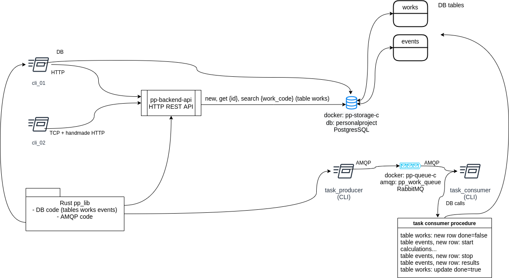

# Rust backend project

## Overview

1. HTTP REST API to create/retrieve/search "work to do": `pp_backend_api`.
2. Postgres DB via Docker with a SQL schema: `pp_storage`.
3. `pp_lib` Rust library sharing the business logic code.
4. CLI utility (`cli_01`) to interact with the HTTP API and the DB directly via `pp_lib`.
5. CLI utility (`cli_02`) to open a TCP socket and perform a manual HTTP 
   call to `pp_backend_api`
6. AMQP RabbitMQ queue to publish/subscribe to produce/consume messages.
7. `task_producer` a schedule (CLI) to produce messages as "work demand" via AMQP.
8. A backend schedule to consume the AMQP queue - `task_consumer` 
   that maps a "work demand" to a "work to do" in the DB, then stores
   "events" in the DB table to track the execution of the work to do.

All the operations can be performed with a dedicated target in the `Makefile`.

## Architecture

